# Character Design Images

キャラクターデザイン画像を整理して保管するためのリポジトリです。原画、書き出し画像、参考画像、サムネイルを分けて置き、各画像の権利・用途・状態は `metadata/characters.csv` に記録します。

## Gallery

| Character | Preview | Export |
| --- | --- | --- |
| Ayano Yukimura | 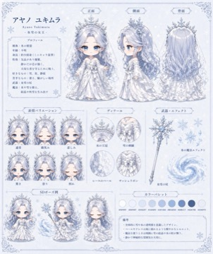 | [character sheet](assets/exports/ayano-yukimura/ayano-yukimura_default_character-sheet_v001.jpeg) |
| Fuhyo | 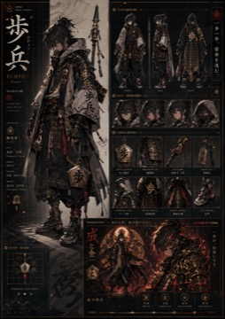 | [character sheet](assets/exports/fuhyo/fuhyo_default_character-sheet_v001.png) |
| Hisha | 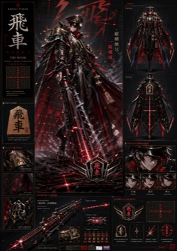 | [character sheet](assets/exports/hisha/hisha_default_character-sheet_v001.png) |
| Kakugyo | 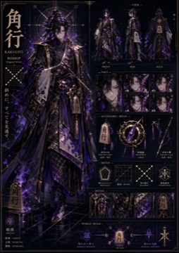 | [character sheet](assets/exports/kakugyo/kakugyo_default_character-sheet_v001.png) |
| Kohaku | 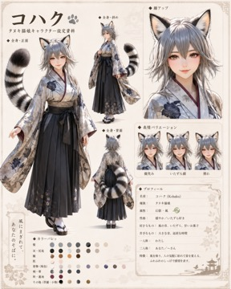 | [character sheet](assets/exports/kohaku/kohaku_default_character-sheet_v001.png) |
| Maki | 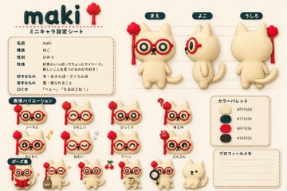 | [character sheet](assets/exports/maki/maki_default_character-sheet_v001.png) |
| Momiji | 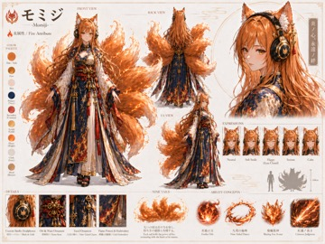 | [character sheet](assets/exports/momiji/momiji_default_character-sheet_v001.png) |
| Onizuka | 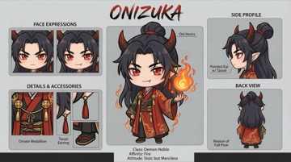 | [character sheet](assets/exports/onizuka/onizuka_default_character-sheet_v001.jpeg) |

## Pet Assets

Codex pet packages generated from the current character designs are stored under `assets/pets/<character-id>/`. Each folder keeps the installable `pet.json` + `spritesheet.webp` pair, extracted frames, contact sheet, frame review, and atlas validation output. The index is `metadata/pets.csv`.

Animated WebP previews play every sprite-sheet row from the pet frame manifest and are kept under `assets/pets/<character-id>/preview/` so GitHub can render them directly in this README. Regenerate them with:

```sh
./scripts/generate-web-previews.py
```

| Character | Web Preview | Pet QA | Package |
| --- | --- | --- | --- |
| Ayano Yukimura | 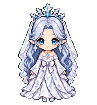 | 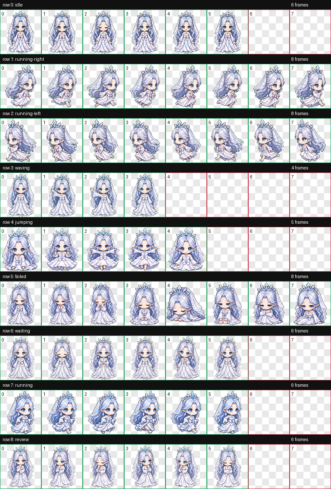 | [pet package](assets/pets/ayano-yukimura/) |
| Fuhyo | 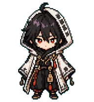 | 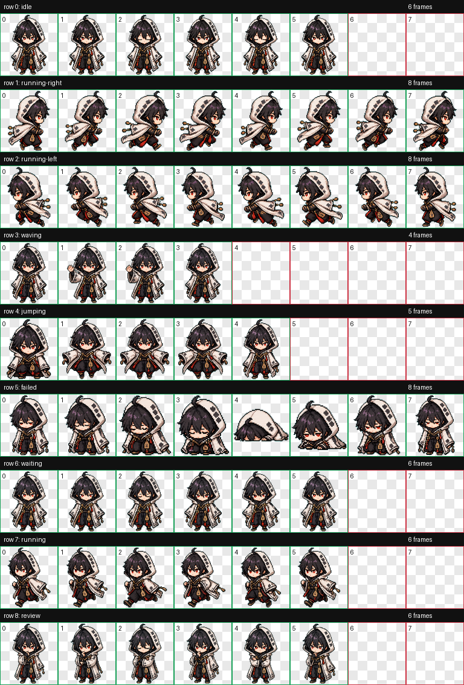 | [pet package](assets/pets/fuhyo/) |
| Hisha | 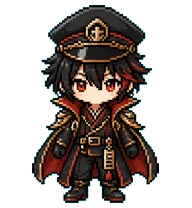 | 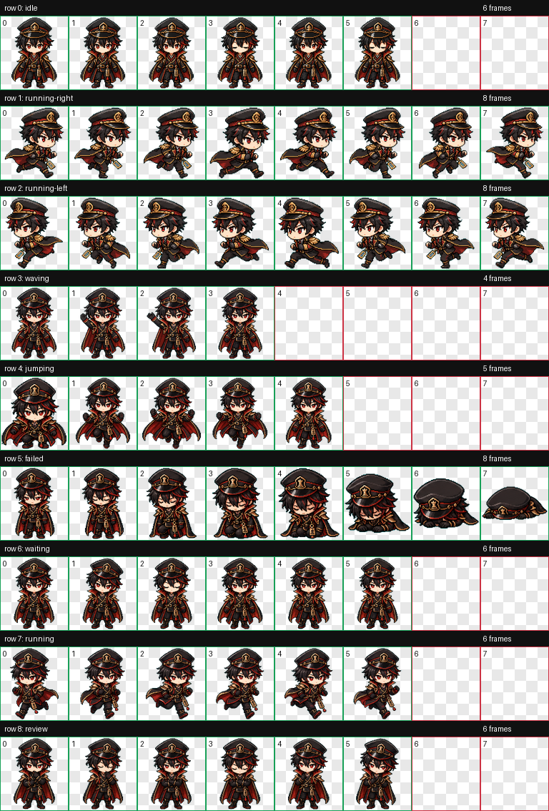 | [pet package](assets/pets/hisha/) |
| Kakugyo | 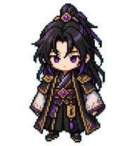 | 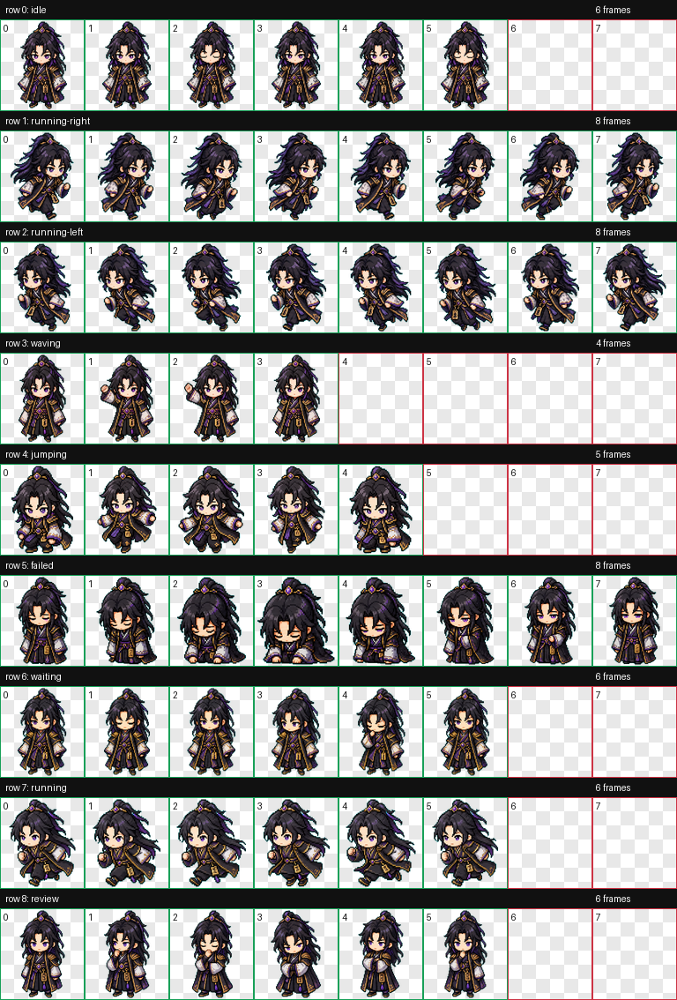 | [pet package](assets/pets/kakugyo/) |
| Kohaku | 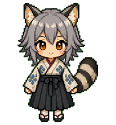 | 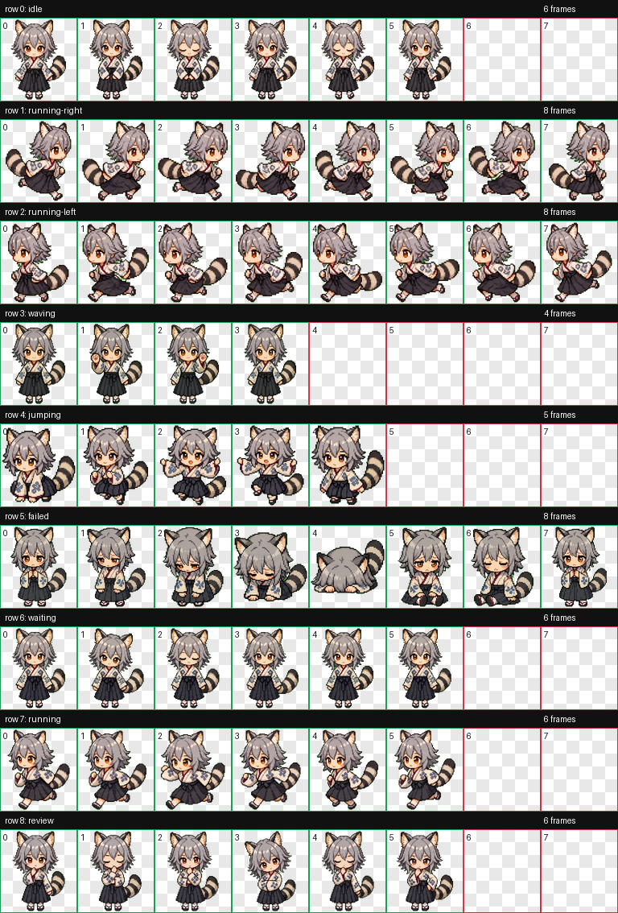 | [pet package](assets/pets/kohaku/) |
| Maki |  | 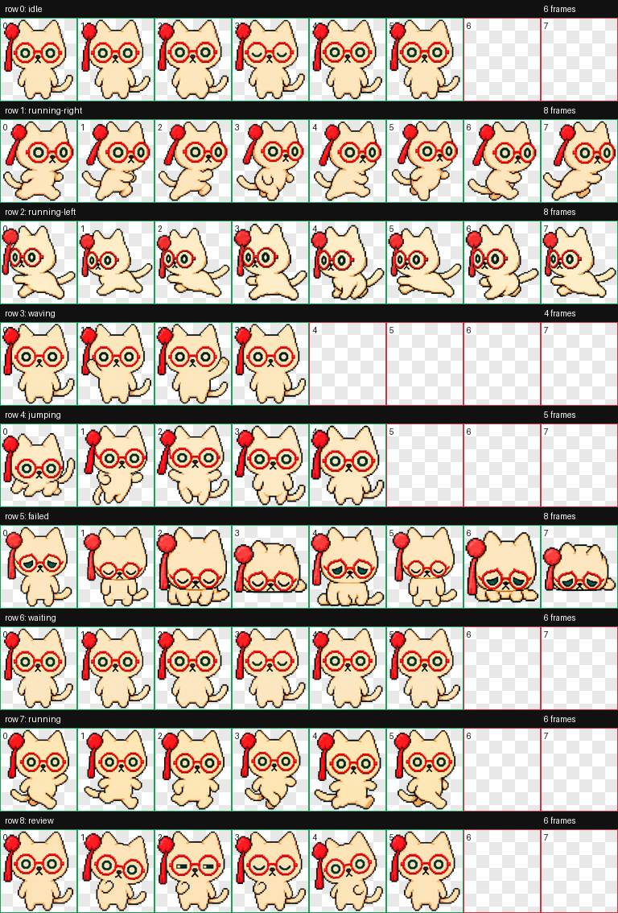 | [pet package](assets/pets/maki/) |
| Momiji |  | 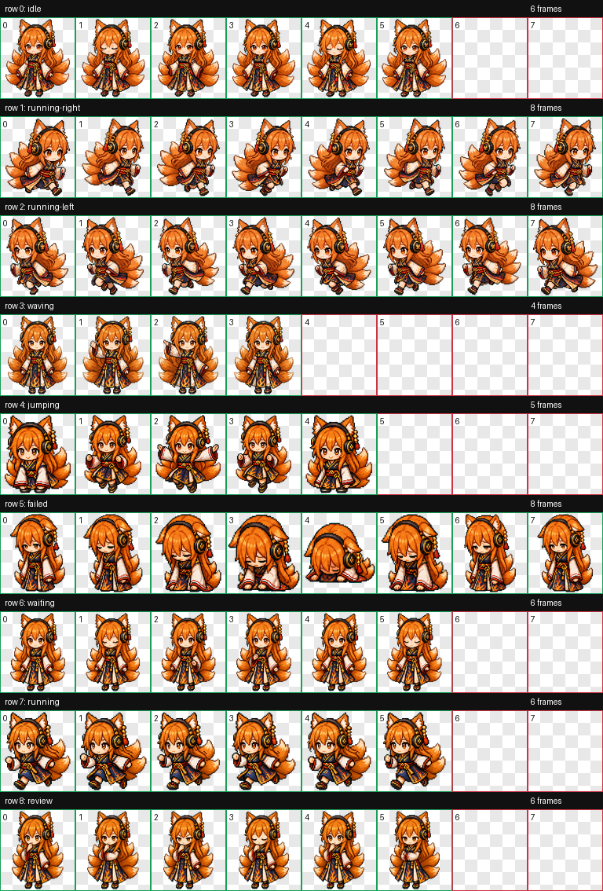 | [pet package](assets/pets/momiji/) |
| Onizuka | 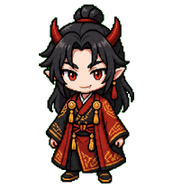 | 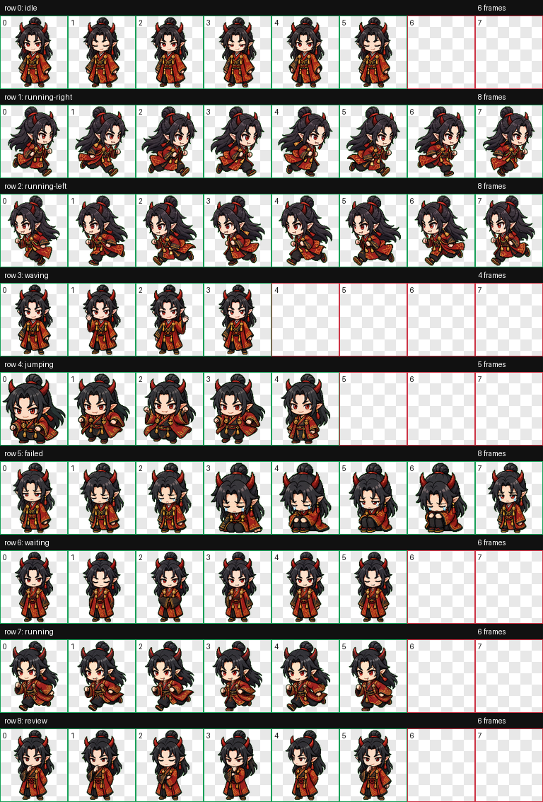 | [pet package](assets/pets/onizuka/) |

## Directory Layout

```text
assets/
  originals/   # 元データ、ラフ、PSD/CLIP/Procreate など
  exports/     # PNG/JPEG/WebP など共有・確認用の書き出し
  pets/        # Codex pet packages, extracted frames, web previews, QA, validation
  references/  # 参考画像、ムードボード、外部資料
  thumbnails/  # 一覧確認用の軽量サムネイル
metadata/
  characters.csv
  pets.csv
docs/
  naming.md
```

## Git LFS

原本、参考画像、大容量の制作ファイルは Git LFS で管理します。公開プレビューしやすい `assets/exports/` と `assets/thumbnails/` は通常の Git blob として保存します。初回だけ次を実行してください。

```sh
git lfs install
```

このリポジトリでは `.gitattributes` で `assets/originals/`、`assets/references/`、主要な制作ファイル形式、アーカイブ形式を LFS 対象にしています。

## Codex Skill

このリポジトリは Codex Skill としても使えます。キャラクター画像、キャラ設定、マスコット、アバター、漫画・ゲーム向けキャラ素材を使う作業では、まずこのリポジトリの `metadata/characters.csv` と `assets/exports/` を優先します。

ローカルでは次の symlink でインストールしています。

```text
/Users/admin/.codex/skills/character-design-images -> /Users/admin/Prj/character-design-images
```

## Adding Images

1. 画像を用途に合う `assets/` 配下へ追加します。
2. `metadata/characters.csv` にキャラクター名、バリアント、ライセンス、画像パスを追記します。
3. ファイル名は `docs/naming.md` のルールに合わせます。

Codex pet を追加・更新する場合は `assets/pets/<character-id>/` に package と QA 一式を置き、`metadata/pets.csv` を更新します。

```sh
git status --short
git add assets metadata
git commit -m "Add <character-name> design images"
```

## Rights

このリポジトリ全体に一括ライセンスは設定していません。各画像の利用可否は `metadata/characters.csv` と `RIGHTS.md` を確認してください。
